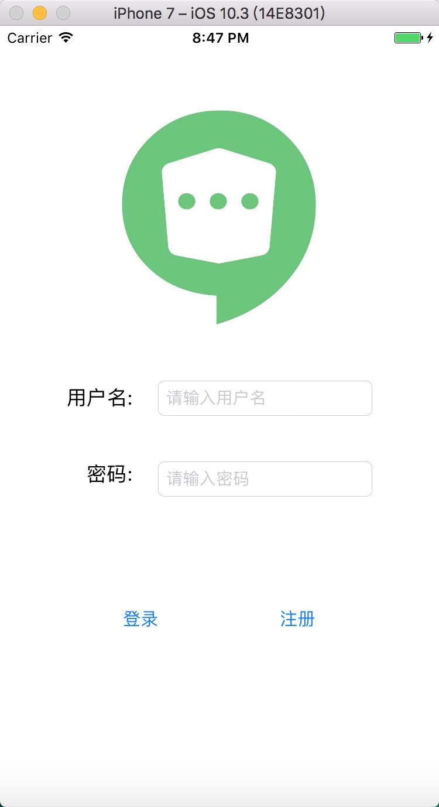
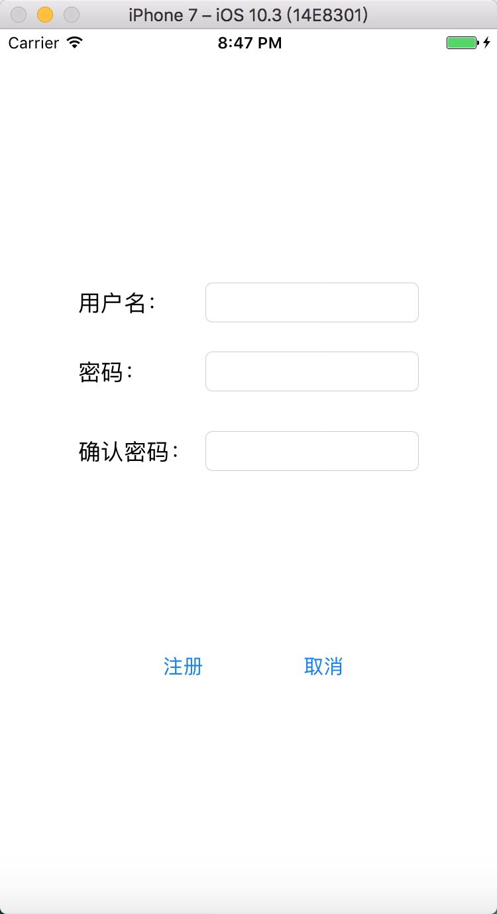
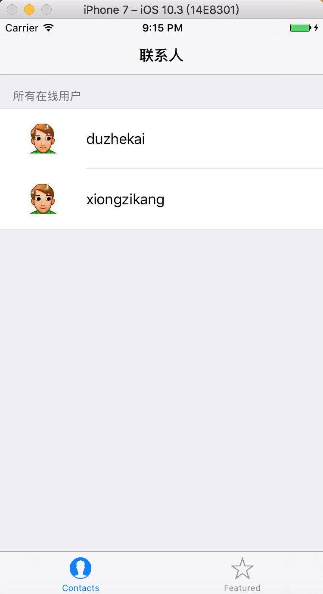
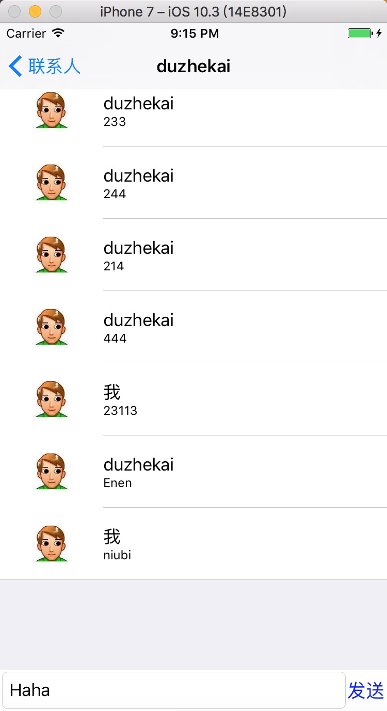

# ChatApp for IOS

## 简介
我的第一个IOS程序。实现了比较基本的文字聊天功能。

项目是用Objective-C写的，这是一门非常神奇的语言，一天可以上手，个人非常喜欢它的语言设计。

## 实现

本项目引用了FMDATABASE，一个封装了sqlite接口的简便的数据库操作类的第三方库，除此之外都是自己从零开始开发。通信方面用的都是TCP连接，设计了一些小的语句格式规则分别对应 登录验证 收发消息 更新在线情况 。

服务器端由于目前只有消息转发服务，因此由C语言套接字实现，目前做了登录，注册，消息转发的功能。后期如果需要加其他服务，服务端会考虑用http + websocket，服务端目前没有做存储，因此不支持客户端发送离线消息，只允许两个在线的人聊天。

客户端做了消息的存储，用的是sqlite，因此任何时候都可以看到以前所有的聊天记录，并且做了一系列的消息响应机制，在有消息的时候可以实时看到界面的刷新。

使用截图如下：

1. 登录界面

2. 注册界面

3. app主界面

4. 聊天界面

## 任何问题
任何问题请联系646424878@qq.com 谢谢

